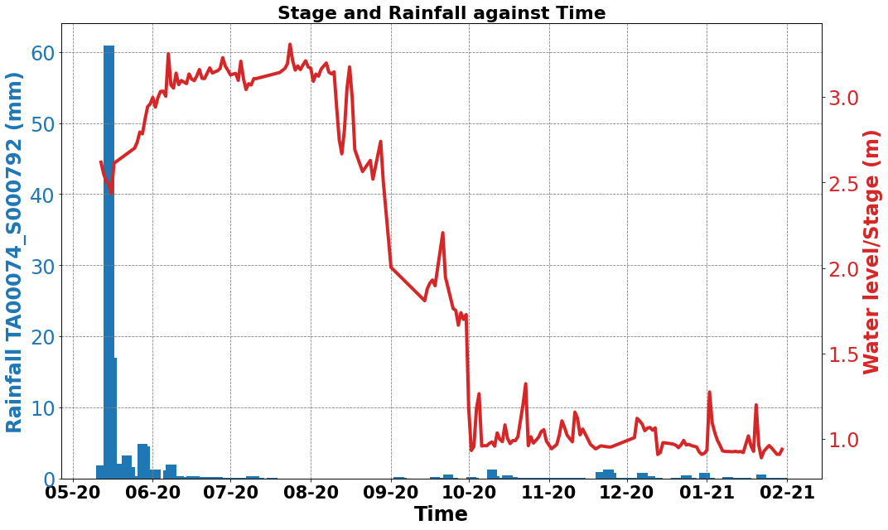
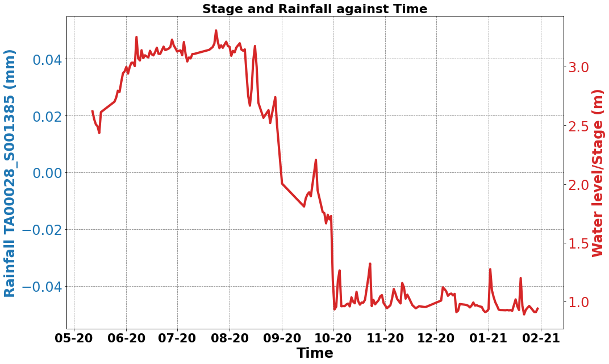
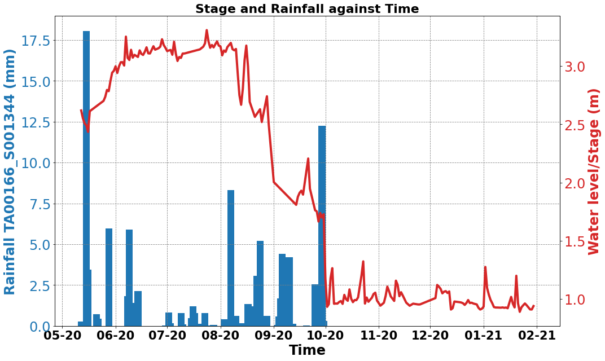

## Water Level Pipeline 
- A series of functions to be added to the filter-stations module in pypi to evalute which TAHMO stations to use that corroborates with the water level
- All begins with the coordinates of the gauging station(location of the monitoring sensor)


```python
import os
from pathlib import Path
import haversine as hs
import pandas as pd
import numpy as np
import datetime
import statsmodels.api as sm
from matplotlib.dates import DateFormatter
import matplotlib.pyplot as plt

# config_path
config_path = os.path.join(Path(os.getcwd()).parent.absolute(), 'config.json')
```


```python
from filter_stations import retreive_data, Interactive_maps, Filter
import json
# Authentication
with open(config_path) as f:
    conf = json.load(f)

apiKey = conf['apiKey']
apiSecret = conf['apiSecret']
fs = retreive_data(apiKey, apiSecret)
```


```python
# given the radius and the longitude and latitude of the gauging station, return the stations within
def stations_within_radius(radius, latitude, longitude, df=False):
    stations  = fs.get_stations_info()
    stations['distance'] = stations.apply(lambda row: hs.haversine((latitude, longitude), (row['location.latitude'], row['location.longitude'])), axis=1)
    infostations = stations[['code', 'location.latitude','location.longitude', 'distance']].sort_values('distance')
    if df:
        return infostations[infostations['distance'] <= radius]
    else:
        return infostations[infostations['distance'] <= radius].code.values
```


```python
ewaso = stations_within_radius(100, -0.406689, 36.96301)
ewaso
```

    API request: services/assets/v2/stations
    


    array(['TA00283', 'TA00378', 'TA00754', 'TA00074', 'TA00196', 'TA00073',
           'TA00056', 'TA00029', 'TA00416', 'TA00719', 'TA00258', 'TA00622',
           'TA00028', 'TA00414', 'TA00190', 'TA00078', 'TA00024', 'TA00080',
           'TA00166', 'TA00108', 'TA00026', 'TA00189', 'TA00250', 'TA00182',
           'TA00715', 'TA00377', 'TA00027', 'TA00057', 'TA00134', 'TA00448',
           'TA00774', 'TA00773', 'TA00772', 'TA00775', 'TA00771', 'TA00679',
           'TA00770'], dtype=object)


The assumption here is one can have credential but not the data
- From the list of stations get the precipitation data with a certain data completeness check provided
- Additionally the start and end date if the data is not provided
- The default start date is the day the sensors were set up at DSAIL
- Chck the documentation on the types of variables available


```python
def stations_data_check(stations_list, percentage=1, start_date=None, end_date=None, data=None, variables=['pr'], csv_file=None):
    if data is None:
        data = fs.multiple_measurements(stations_list, startDate=start_date, endDate=end_date, variables=variables, csv_file=csv_file)

    # Check the percentage of missing data and return the stations with less than the percentage of missing data
    data.index = data.index.astype('datetime64[ns]')
    data = data.dropna(axis=1, thresh=int(len(data) * percentage))
    data.to_csv(f'{csv_file}.csv')
    return data
```


```python
stations_df = stations_data_check(list(ewaso), start_date='2022-12-01', end_date='2022-12-31', variables=['pr'], csv_file='ewaso2.csv')
```

Apart from the completeness another method of validation by eliminating unusable sensors is checking for a positive correlation and lag
- The default lag is 3 days between a particular station and the gauging station
- The required format is a timeseries data 
- Provide the column names for evaluation format = [Date, data]
- with the change in parameters one can choose above or below threshold 


```python
def stations_lag(weather_stations_df, gauging_stations_df, gauging_station_columns, date=None, lag=3, above=False, below=False):
    
    
    # set the date as axis
    # weather_station_df = weather_stations_df.set_index('Date')
    # weather_stations_df.Date= weather_stations_df.Date.apply(pd.to_datetime,dayfirst = True)
    # weather_stations_df = weather_stations_df.set_index('Date')
    # get the starting date of the gauging station the first value
    if date is None:
        date = gauging_stations_df.loc[0, gauging_station_columns[0]]
    start_date = datetime.datetime.strptime(date, "%d/%m/%Y")
    end_date = start_date + datetime.timedelta(len(gauging_stations_df)-1)
    # get the ddataframe from start date to end date
    df_fit = weather_stations_df[start_date:end_date]
    # get the water data list
    water_list = list(gauging_stations_df[f'{gauging_station_columns[1]}'])
    above_thresh_lag = dict()
    below_thresh_lag = dict()
    # get the lag for every column against the water data 
    for cols in df_fit.columns:
        select_list = list(df_fit[cols])
        coefficient_list = list(sm.tsa.stattools.ccf(select_list,water_list, adjusted=False))
        a = np.argmax(coefficient_list)
        b = coefficient_list[a]
        if a > lag:
            above_thresh_lag[cols] = {
                'lag': a,
                'coefficient': b,
                'coefficient_list': coefficient_list,
                'select_list': select_list,
                'water_list' : water_list
            }
        else:
            below_thresh_lag[cols] = {
                'lag': a,
                'coefficient': b,
                'coefficient_list': coefficient_list,
                'select_list': select_list,
                'water_list' : water_list
            }
    if above and below:
        return above_thresh_lag, below_thresh_lag
    elif above:
        return above_thresh_lag
    elif below:
        return below_thresh_lag


```


```python
water_six = pd.read_csv('./water-level-data-ewaso/1E2020.csv')
water_six
```


<div>
<style scoped>
    .dataframe tbody tr th:only-of-type {
        vertical-align: middle;
    }

    .dataframe tbody tr th {
        vertical-align: top;
    }

    .dataframe thead th {
        text-align: right;
    }
</style>
<table border="1" class="dataframe">
  <thead>
    <tr style="text-align: right;">
      <th></th>
      <th>time</th>
      <th>water_level(m)</th>
    </tr>
  </thead>
  <tbody>
    <tr>
      <th>0</th>
      <td>12/05/2020</td>
      <td>2.618646</td>
    </tr>
    <tr>
      <th>1</th>
      <td>13/05/2020</td>
      <td>2.551392</td>
    </tr>
    <tr>
      <th>2</th>
      <td>14/05/2020</td>
      <td>2.507711</td>
    </tr>
    <tr>
      <th>3</th>
      <td>15/05/2020</td>
      <td>2.491130</td>
    </tr>
    <tr>
      <th>4</th>
      <td>16/05/2020</td>
      <td>2.434761</td>
    </tr>
    <tr>
      <th>...</th>
      <td>...</td>
      <td>...</td>
    </tr>
    <tr>
      <th>259</th>
      <td>26/01/2021</td>
      <td>0.947099</td>
    </tr>
    <tr>
      <th>260</th>
      <td>27/01/2021</td>
      <td>0.929186</td>
    </tr>
    <tr>
      <th>261</th>
      <td>28/01/2021</td>
      <td>0.911274</td>
    </tr>
    <tr>
      <th>262</th>
      <td>29/01/2021</td>
      <td>0.910711</td>
    </tr>
    <tr>
      <th>263</th>
      <td>30/01/2021</td>
      <td>0.939971</td>
    </tr>
  </tbody>
</table>
<p>264 rows × 2 columns</p>
</div>


```python
lag_ = stations_lag(stations_df, water_six, ['time', 'water_level(m)'], lag=3,below=True)
lag_
```

#### Plotting 
Provides visuals of the data
- An option to save the
- An option of choosing the dpi 
- provide the startDate based on the water collection starting date


```python
lag_[list(lag_.keys())[0]]['water_list']
```


```python
import warnings
warnings. filterwarnings('ignore')
```


```python
def plot_figs(weather_stations, water_list, threshold_list, save=False, dpi=500, date='11-02-2021'):
    start_date = datetime.datetime.strptime(date, "%d-%m-%Y")
    end_date = start_date + datetime.timedelta(len(water_list)-1)
    # weather_stations = weather_stations.set_index('Date')
    df_plot = weather_stations[start_date:end_date]
    df_plot = df_plot[threshold_list].reset_index()
    df_plot.rename(columns={'index':'Date'}, inplace=True)
    
    
    plt.rcParams['figure.figsize'] = (15, 9)
    print('Begin plotting!')
    
    for cols in df_plot.columns[1:]:
        fig, ax1 = plt.subplots()
        color = 'tab:blue'
        ax1.set_xlabel(f'Time', fontsize=24, weight='bold')
        ax1.set_ylabel(f'Rainfall {cols} (mm)', color=color, fontsize=24, weight='bold')
        ax1.bar(pd.to_datetime(df_plot['Date'], format="%d/%m/%Y"), df_plot[f'{cols}'], color=color, width=4, alpha=1.0)
        ax1.tick_params(axis='y', labelcolor=color, labelsize=24)
        ax1.tick_params(axis='x')
        ax1.set_xticklabels(df_plot['Date'], fontsize=21, weight='bold')
        ax1.grid(color='gray', linestyle='--', linewidth=0.8)
        ax1.set(facecolor="white")
        ax2 = ax1.twinx()  # instantiate a second axes that shares the same x-axis

        color = 'tab:red'
        ax2.set_ylabel('Water level/Stage (m)', color=color, fontsize=24, weight='bold')
        ax2.plot(pd.to_datetime(df_plot['Date'], format="%d/%m/%Y"), water_list, color=color, linewidth=4)
        ax2.tick_params(axis='y', labelcolor=color, labelsize=24)
        ax2.set(facecolor="white")
        plt.title('Stage and Rainfall against Time', fontsize=22, weight='bold')

        date_form = DateFormatter("%m-%y")
        ax1.xaxis.set_major_formatter(date_form)
        fig.tight_layout()

        if save:
            fig.savefig(f'{cols}.png', dpi=dpi)

```


```python
plot_figs(stations_df, lag_[list(lag_.keys())[0]]['water_list'], list(lag_.keys()), save=True, date='12-05-2020')
```

    Begin plotting!
    


    

    


    

    


    

    


    

    


    

    


    

    


    

    


    

    


    

    


Format to get the stations maetadata


```python
def filter_metadata(lag_keys):
    captured_list = [i.split('_')[0] for i in list(lag_keys)]
    return fs.get_stations_info(multipleStations=captured_list)
```


```python
filter_metadata(list(lag_.keys()))
```

    API request: services/assets/v2/stations
    


<div>
<style scoped>
    .dataframe tbody tr th:only-of-type {
        vertical-align: middle;
    }

    .dataframe tbody tr th {
        vertical-align: top;
    }

    .dataframe thead th {
        text-align: right;
    }
</style>
<table border="1" class="dataframe">
  <thead>
    <tr style="text-align: right;">
      <th></th>
      <th>code</th>
      <th>status</th>
      <th>installationdate</th>
      <th>elevationground</th>
      <th>sensorinstallations</th>
      <th>dataloggerinstallations</th>
      <th>creatorid</th>
      <th>created</th>
      <th>updaterid</th>
      <th>updated</th>
      <th>...</th>
      <th>location.countrycode</th>
      <th>location.zipcode</th>
      <th>location.latitude</th>
      <th>location.longitude</th>
      <th>location.elevationmsl</th>
      <th>location.note</th>
      <th>location.creatorid</th>
      <th>location.created</th>
      <th>location.updaterid</th>
      <th>location.updated</th>
    </tr>
  </thead>
  <tbody>
    <tr>
      <th>26</th>
      <td>TA00028</td>
      <td>1</td>
      <td>2015-08-31T00:00:00Z</td>
      <td>9.0</td>
      <td>None</td>
      <td>None</td>
      <td>2</td>
      <td>2018-12-11T08:35:17.888233Z</td>
      <td>2</td>
      <td>2018-12-11T08:35:17.888233Z</td>
      <td>...</td>
      <td>KE</td>
      <td></td>
      <td>0.055219</td>
      <td>37.136747</td>
      <td>2003.6</td>
      <td>{}</td>
      <td>2</td>
      <td>2018-10-26T13:32:16.15537Z</td>
      <td>37</td>
      <td>2022-06-30T11:11:50.27135Z</td>
    </tr>
    <tr>
      <th>27</th>
      <td>TA00029</td>
      <td>1</td>
      <td>2015-09-02T00:00:00Z</td>
      <td>2.0</td>
      <td>None</td>
      <td>None</td>
      <td>2</td>
      <td>2018-12-11T08:36:19.30342Z</td>
      <td>2</td>
      <td>2018-12-11T08:36:19.30342Z</td>
      <td>...</td>
      <td>KE</td>
      <td></td>
      <td>-0.500776</td>
      <td>36.587511</td>
      <td>2545.8</td>
      <td>{}</td>
      <td>2</td>
      <td>2018-10-26T13:33:31.451613Z</td>
      <td>37</td>
      <td>2022-02-28T12:25:09.578242Z</td>
    </tr>
    <tr>
      <th>53</th>
      <td>TA00057</td>
      <td>1</td>
      <td>2015-10-08T00:00:00Z</td>
      <td>2.0</td>
      <td>None</td>
      <td>None</td>
      <td>2</td>
      <td>2018-12-11T09:21:29.092833Z</td>
      <td>2</td>
      <td>2018-12-11T09:21:29.092833Z</td>
      <td>...</td>
      <td>KE</td>
      <td></td>
      <td>-1.253030</td>
      <td>36.856487</td>
      <td>1645.3</td>
      <td>{}</td>
      <td>2</td>
      <td>2018-10-29T09:13:33.768613Z</td>
      <td>2</td>
      <td>2022-07-26T07:34:06.603938Z</td>
    </tr>
    <tr>
      <th>68</th>
      <td>TA00074</td>
      <td>1</td>
      <td>2015-11-19T00:00:00Z</td>
      <td>2.0</td>
      <td>None</td>
      <td>None</td>
      <td>2</td>
      <td>2018-12-11T09:38:25.742397Z</td>
      <td>2</td>
      <td>2018-12-11T09:38:25.742397Z</td>
      <td>...</td>
      <td>KE</td>
      <td></td>
      <td>-0.566080</td>
      <td>37.074412</td>
      <td>1726.8</td>
      <td>{}</td>
      <td>2</td>
      <td>2018-10-29T10:35:28.49617Z</td>
      <td>2</td>
      <td>2022-07-26T07:38:42.100985Z</td>
    </tr>
    <tr>
      <th>74</th>
      <td>TA00080</td>
      <td>1</td>
      <td>2016-01-28T00:00:00Z</td>
      <td>2.0</td>
      <td>None</td>
      <td>None</td>
      <td>2</td>
      <td>2018-12-11T09:43:10.523398Z</td>
      <td>2</td>
      <td>2018-12-11T09:43:10.523398Z</td>
      <td>...</td>
      <td>KE</td>
      <td></td>
      <td>-1.087589</td>
      <td>36.818402</td>
      <td>1777.3</td>
      <td>{}</td>
      <td>2</td>
      <td>2018-10-29T10:53:47.845042Z</td>
      <td>37</td>
      <td>2022-02-28T13:07:04.709903Z</td>
    </tr>
    <tr>
      <th>150</th>
      <td>TA00166</td>
      <td>1</td>
      <td>2017-05-11T00:00:00Z</td>
      <td>2.0</td>
      <td>None</td>
      <td>None</td>
      <td>2</td>
      <td>2018-12-12T08:29:28.10697Z</td>
      <td>2</td>
      <td>2018-12-12T08:29:28.10697Z</td>
      <td>...</td>
      <td>KE</td>
      <td></td>
      <td>-0.319508</td>
      <td>37.659139</td>
      <td>1404.0</td>
      <td>{}</td>
      <td>2</td>
      <td>2018-11-10T08:47:37.949135Z</td>
      <td>2</td>
      <td>2018-11-10T08:47:37.949135Z</td>
    </tr>
  </tbody>
</table>
<p>6 rows × 28 columns</p>
</div>


```python

```
