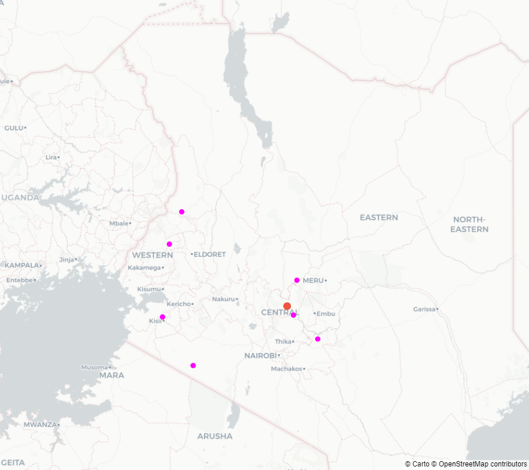
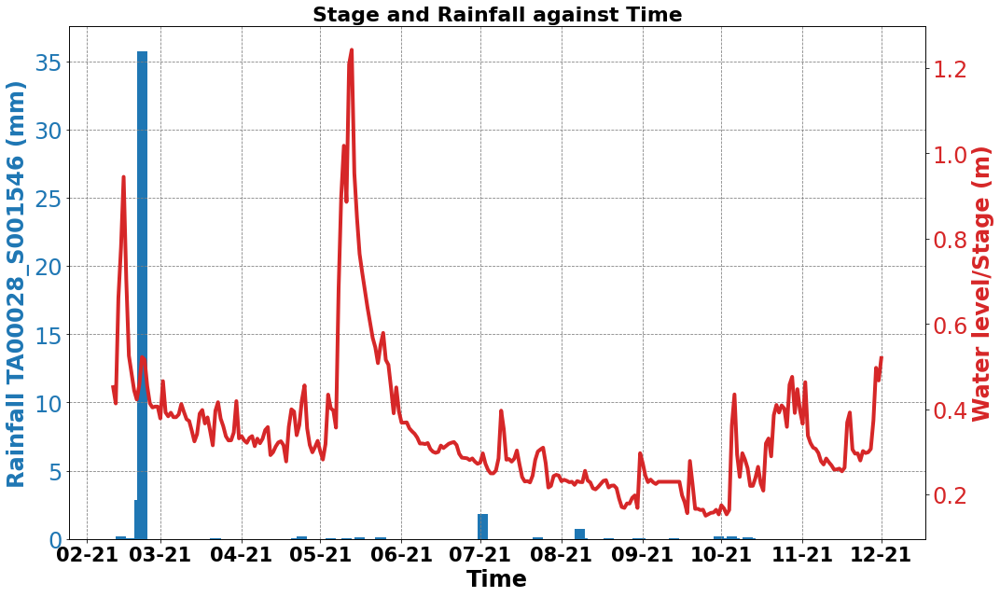
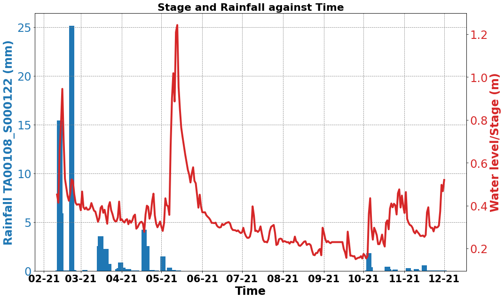
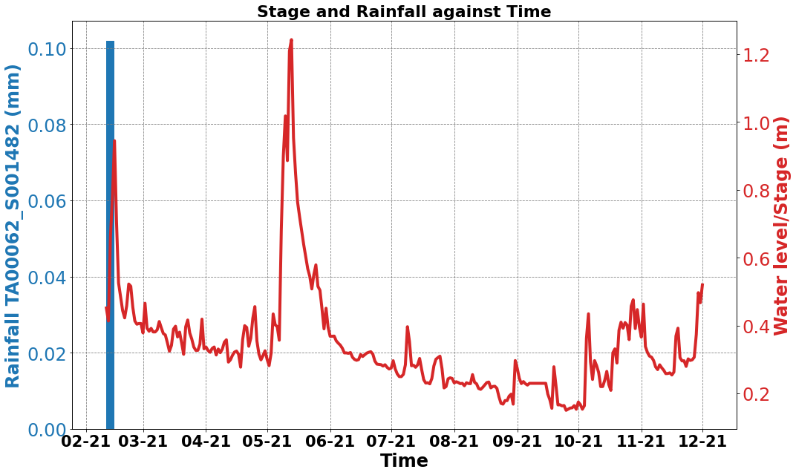
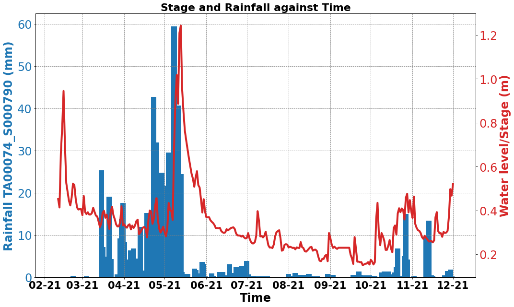
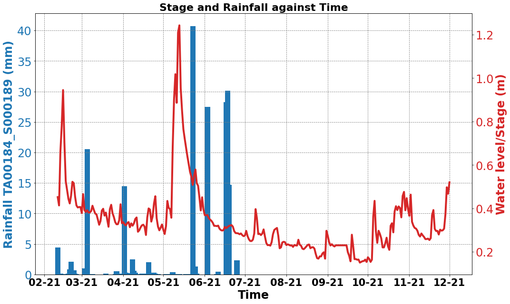
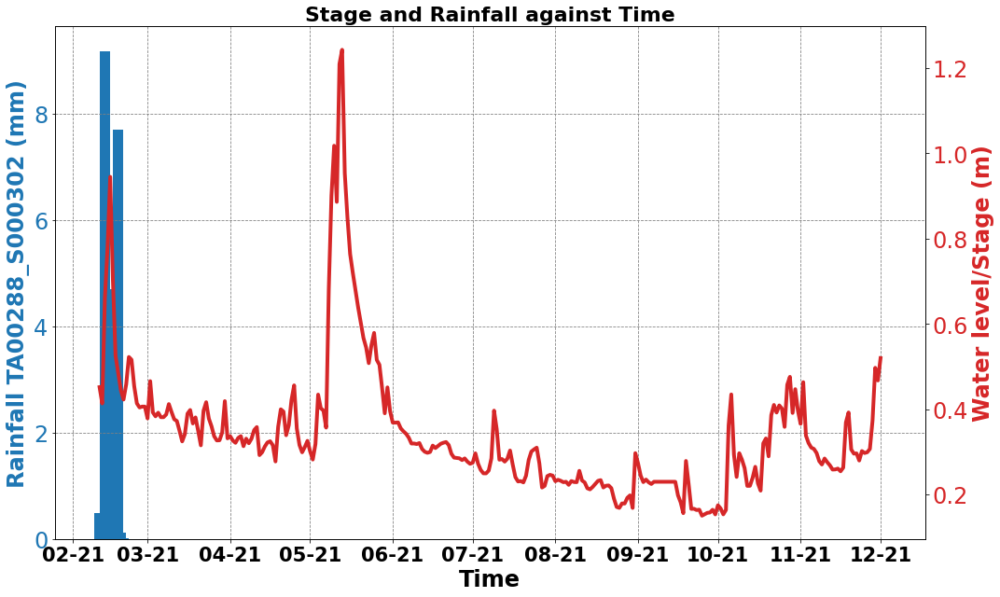
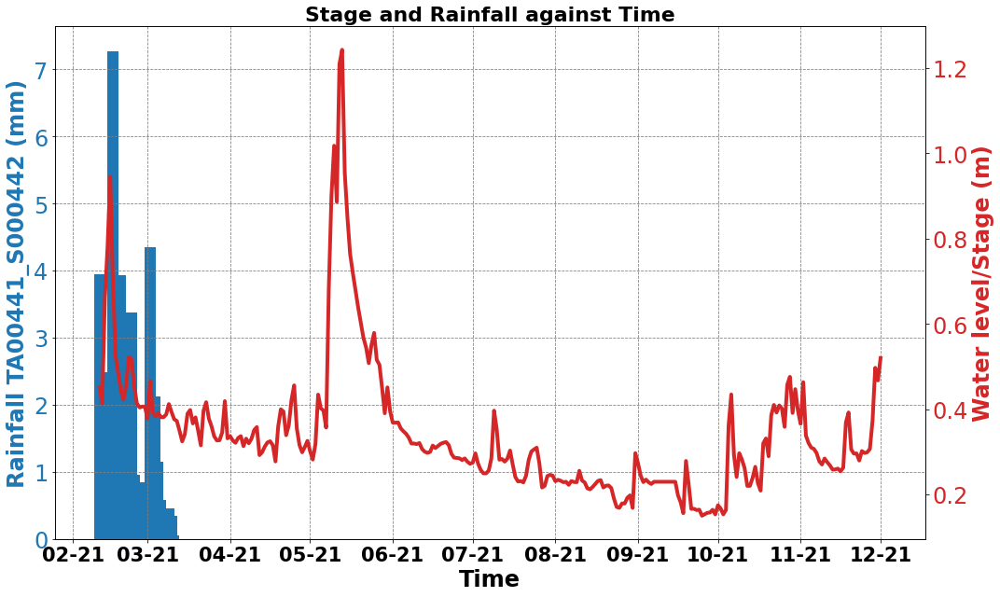

## Water Level Pipeline 
- A series of functions to be added to the filter-stations module in pypi to evalute which TAHMO stations to use that corroborates with the water level
- All begins with the coordinates of the gauging station(location of the monitoring sensor)


```python
import os
from pathlib import Path
import haversine as hs
import pandas as pd
import numpy as np
import datetime
import statsmodels.api as sm
from matplotlib.dates import DateFormatter
import matplotlib.pyplot as plt
import warnings
import dateutil.parser
warnings.filterwarnings('ignore')

# config_path
config_path = os.path.join(Path(os.getcwd()).parent.parent.absolute(), 'config.json')
```


```python
from test import retreive_data, Interactive_maps, Filter, pipeline, Water_level
import json
# Authentication
with open(config_path) as f:
    conf = json.load(f)

apiKey = conf['apiKey']
apiSecret = conf['apiSecret']
map_api_key = conf['map_api_key']
ret = retreive_data(apiKey, apiSecret, map_api_key)
pipe = pipeline(apiKey, apiSecret, map_api_key)
maps = Interactive_maps(apiKey, apiSecret, map_api_key)
filt = Filter(apiKey, apiSecret, map_api_key)
wl = Water_level()
```

Loading data


```python
# muringato lat,lon
muringato_loc = wl.coordinates('muringato')
# ewaso lat,lon
ewaso_loc = wl.coordinates('ewaso')

# weather data from 2020 to 2022
weather_data = filt.filter_pr('2020-01-01', '2022-12-31', country='Kenya')

# water level data from muringato and ewaso
muringato_data = wl.water_level_data('muringato')
ewaso_data = wl.water_level_data('ewaso')
```

    Retrieving precipitation data from BigQuery...
    


```python
start_date = '2021-02-11'
end_date = '2021-12-01'
muringato_data_s6_2021 = muringato_data[['muringato_sensor6']].loc[start_date:end_date]
muringato_data_s6_2021.columns = ['water_level']

```


```python
list(pd.date_range(start=start_date, end=end_date, freq='D').difference(muringato_data[['muringato_sensor6']].index))
```


    []


```python
# drop weather stations with missing data
weather_stations_data = weather_data.dropna(axis=1)
weather_stations_data.isna().sum().sum()
weather_stations_data = weather_stations_data.loc[start_date:end_date]
```


```python
above, below = pipe.shed_stations(weather_stations_data,
                   muringato_data_s6_2021,
                   muringato_loc,
                   100,
                   lag=50
                   )

```


```python
below_stations = [i.split('_')[0] for i in below.keys()]
print(below_stations)
below_stations_metadata = ret.get_stations_info(multipleStations=below_stations)[['code', 'location.latitude', 'location.longitude']]
```

    ['TA00028', 'TA00108', 'TA00062', 'TA00074', 'TA00184', 'TA00288', 'TA00441']
    


```python
below_stations_metadata['distance']= below_stations_metadata.apply(lambda row: hs.haversine((muringato_loc[0], 
                                                                                             muringato_loc[1]), (row['location.latitude'], 
                                                                                                             row['location.longitude'])), axis=1)
below_stations_metadata.sort_values(by='distance')
```


<div>
<style scoped>
    .dataframe tbody tr th:only-of-type {
        vertical-align: middle;
    }

    .dataframe tbody tr th {
        vertical-align: top;
    }

    .dataframe thead th {
        text-align: right;
    }
</style>
<table border="1" class="dataframe">
  <thead>
    <tr style="text-align: right;">
      <th></th>
      <th>code</th>
      <th>location.latitude</th>
      <th>location.longitude</th>
      <th>distance</th>
    </tr>
  </thead>
  <tbody>
    <tr>
      <th>68</th>
      <td>TA00074</td>
      <td>-0.566080</td>
      <td>37.074412</td>
      <td>21.623104</td>
    </tr>
    <tr>
      <th>26</th>
      <td>TA00028</td>
      <td>0.055219</td>
      <td>37.136747</td>
      <td>54.874887</td>
    </tr>
    <tr>
      <th>96</th>
      <td>TA00108</td>
      <td>-0.991916</td>
      <td>37.507288</td>
      <td>88.864489</td>
    </tr>
    <tr>
      <th>167</th>
      <td>TA00184</td>
      <td>-1.464180</td>
      <td>35.287930</td>
      <td>220.249152</td>
    </tr>
    <tr>
      <th>398</th>
      <td>TA00441</td>
      <td>-0.599323</td>
      <td>34.744223</td>
      <td>247.636699</td>
    </tr>
    <tr>
      <th>266</th>
      <td>TA00288</td>
      <td>0.697736</td>
      <td>34.865137</td>
      <td>263.620540</td>
    </tr>
    <tr>
      <th>56</th>
      <td>TA00062</td>
      <td>1.273419</td>
      <td>35.085363</td>
      <td>280.155770</td>
    </tr>
  </tbody>
</table>
</div>


```python
# Interactive visuals
import plotly.express as px
import plotly.graph_objects as go

fig = px.scatter_mapbox(below_stations_metadata, 
                        lat="location.latitude", 
                        lon="location.longitude", 
                        hover_name="code", 
                        hover_data=["distance"],
                        color_discrete_sequence=["fuchsia"],
                        zoom=8,
                        height=800,
                        )
# update marker size
fig.update_traces(marker=dict(size=10))
# add a point for the central station
fig.add_trace(go.Scattermapbox(
        lat=[muringato_loc[0]],
        lon=[muringato_loc[1]],
        mode='markers',
        marker=go.scattermapbox.Marker(
            size=14
        ),
        text=['Muringato gauging station'],
    ))

fig.update_layout(
    mapbox_style="carto-positron",
    margin={"r":0,"t":0,"l":0,"b":0},
    showlegend=False
)
fig.show()
```




```python
pipe.plot_figs(
    weather_stations_data,
    list(muringato_data_s6_2021['water_level']),
    list(below.keys()),
    date=dateutil.parser.parse(str(muringato_data_s6_2021.index[0])).strftime('%d-%m-%Y'), 
    save=False   
)
```

    Begin plotting!
    


    

    


    

    


    

    


    

    


    

    


    

    


    

    

